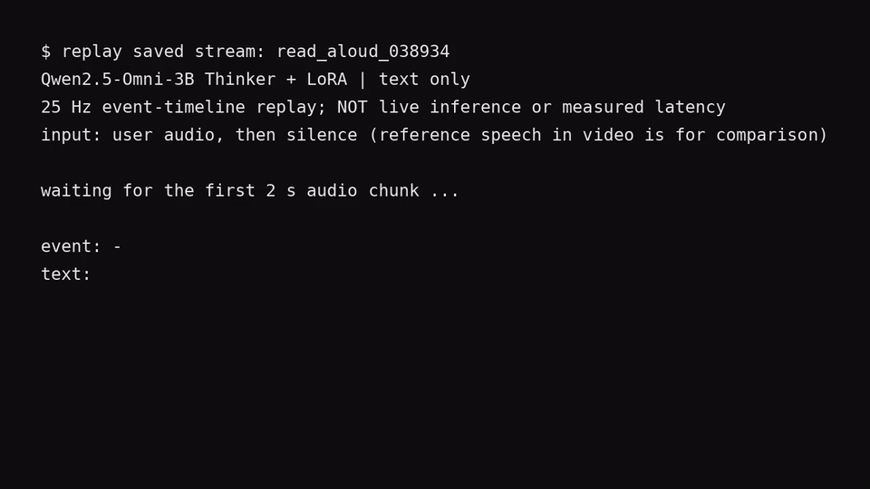

# Qwen Omni Duplex

A small research project on streaming text responses to speech. I use the [Qwen2.5-Omni-3B Thinker](https://huggingface.co/Qwen/Qwen2.5-Omni-3B) to process audio in two-second chunks and predict one event every 40 ms: `IDLE`, `START`, a text token, or `STOP`. The model does not generate speech. I want to understand whether this kind of event timeline can support a full-duplex assistant without a separate turn-taking model.

## One-sample run

The instruction is: “Say it slowly: describe a peaceful countryside in one sentence.”

[Input audio (MP3)](demo/input.mp3) · [Video with audio (MP4)](demo/stream.mp4)

[](demo/stream.mp4)

I overfit this one TASTE example for 500 steps. On the training waveform, teacher forcing, cached free decoding, and chunk-by-chunk generation all match the **386 target events exactly**: 370 `IDLE`, one `START`, 14 text tokens, and one `STOP`. The generated text is “Rolling hills stretch endlessly, dotted with grazing sheep and wildflowers.” The [report](demo/report.json) and [frame trace](demo/training_audio_stream.jsonl) are here too.

The video replays those saved decisions at 25 Hz so the text can be read; it is not a live-inference speed measurement. Its audio plays the 4.41-second user instruction, then the dataset's 11.04-second reference response for comparison. The model actually receives **silence** during that second part and produces **text only**. With just the user audio and no training-length silent block, this checkpoint produces no response. This is a memorization check, not evidence of generalization or simultaneous listening and speaking.

## Method

The dataset builder appends a silent block, as long as the reference response audio, to each spoken instruction. It puts `IDLE` on the user-audio frames, then `START`, the response text tokens, `STOP`, and more `IDLE` on the silent frames. The previous text/control event and the current audio feature are added in the Thinker's hidden space. A weighted next-event loss trains rank-16 LoRA adapters in the text decoder; the audio encoder stays frozen. The full training recipe adds noise and synthetic interruptions, but neither is used in this one-row overfit test.

The data is [TASTE-IF-SFT-48K](https://huggingface.co/datasets/Jaylin0418/TASTE-IF-SFT-48K). This project uses only the Qwen Thinker; it does not train the Talker or an audio codec.

## Reproduce

Use Python 3.11 and a CUDA GPU. From the repository root:

```bash
python3.11 -m venv .venv
.venv/bin/python -m pip install -r requirements.txt
.venv/bin/python -c 'from huggingface_hub import snapshot_download; snapshot_download(repo_id="Qwen/Qwen2.5-Omni-3B", revision="f75b40e3da2003cdd6e1829b1f420ca70797c34e")'
.venv/bin/python -c 'from huggingface_hub import hf_hub_download; hf_hub_download(repo_id="Jaylin0418/TASTE-IF-SFT-48K", repo_type="dataset", filename="data/shuffled_train_part_0008.parquet", local_dir="data/TASTE-IF-SFT-48K")'
.venv/bin/python scripts/prepare_taste_one_row.py
.venv/bin/python scripts/run_taste_one_sample_overfit.py --config configs/taste_one_sample_overfit_038934.yaml
```

The run writes its adapter, separate decoding checks, and frame traces to `outputs/taste-one-sample-overfit-038934/`. To replay a saved trace in your own terminal:

```bash
.venv/bin/python scripts/replay_stream_trace.py --report demo/report.json --trace demo/training_audio_stream.jsonl
```

The larger training recipe is [`configs/turn_packed_main.yaml`](configs/turn_packed_main.yaml). The main implementation is in [`duplex/turn_packed.py`](duplex/turn_packed.py) (data), [`duplex/model.py`](duplex/model.py) (fusion and loss), and [`duplex/streaming.py`](duplex/streaming.py) (generation). I am still investigating why user-only audio fails after the training-aligned overfit succeeds; experiment notes are in [`notes/experiments.md`](notes/experiments.md).

Independent student project. Repository code: Apache 2.0. The Qwen model and TASTE sample retain their own licenses.
