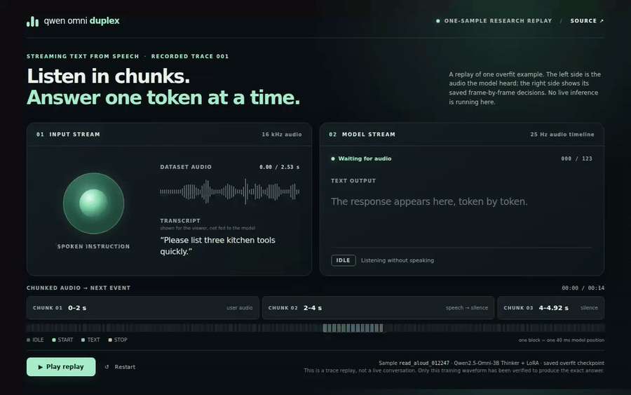

# Qwen Omni Duplex

I am exploring a small question: can a speech model keep listening while deciding, frame by frame, whether to wait, begin a response, write the next text token, or stop? This repository is my text-only experiment with the [Qwen2.5-Omni-3B Thinker](https://huggingface.co/Qwen/Qwen2.5-Omni-3B). It does not synthesize speech.

The short clip below replays a **real saved model trace**. It is one sample that I deliberately overfit, not a live conversation or a claim that the model generalizes.



[Watch the video with the input audio](demo/replay.mp4) · [Replay page files](demo/)

The person in the audio asks for three kitchen tools. The model receives audio in fixed two-second chunks. At each 40 ms model position it predicts `IDLE`, `START`, a text token, or `STOP`; the page shows these decisions arriving in order. The replay uses the recorded inference trace, so no GPU is needed to view it. The animation follows the saved chunk and token sequence; it is not a live latency benchmark.

## Where the project stands

The current checkpoint can memorize one TASTE sample. After 300 updates on that sample, teacher-forced prediction, cached free decoding, and the streaming loop all reproduced its **123/123 training events** and the exact answer: “A whisk, a blender, and a spatula.” The training waveform is 2.531 seconds of user speech followed by 2.388 seconds of silence. When I give the same checkpoint only the user speech, it stays silent. That mismatch is the next problem to solve; this demo intentionally uses the waveform on which the model was trained.

This is a research prototype. It has one verified overfit example, not a usable voice assistant. The model currently outputs text, not audio, and this sample does not demonstrate an interruption or simultaneous speech.

## How it works

```text
2 s audio chunk ──> Qwen audio encoder ──> audio feature at position t
previous text/control event ──────────────> token embedding at position t
                                        add both
                                           ↓
                                     Qwen Thinker
                                           ↓
                            IDLE / START / text / STOP
```

The dataset code turns each conversation into a 25 Hz timeline. User speech occupies the first part; a silent block of the reference response's duration follows it. Text tokens are placed after `START` in that block, then `STOP`, with `IDLE` everywhere else. The model sees the previous event when predicting the current one. Training uses a weighted next-event loss; only rank-16 LoRA weights in the Thinker text decoder are updated. The audio encoder stays frozen. The full TASTE recipe also includes random noise and synthetic interruptions, which are disabled in the one-sample memorization check.

I used the [TASTE-IF-SFT-48K dataset](https://huggingface.co/datasets/Jaylin0418/TASTE-IF-SFT-48K) for the current spoken-instruction data. The interface takes visual cues from [Moshi's demo](https://moshi-chat.kyutai.org/), but this project does not use Moshi's model, audio codec, or live dialogue system.

## Try the replay

Open [`demo/index.html`](demo/index.html) in a browser and press **Play replay**. The page contains the sample audio and recorded event trace; it does not load model weights or contact a server. The video above records that page playing once.

## Reproduce the one-sample run

Use Python 3.11 and a CUDA GPU with roughly 24 GB of VRAM. From the repository root:

```bash
python3.11 -m venv .venv
.venv/bin/python -m pip install -r requirements.txt
.venv/bin/python -c 'from huggingface_hub import snapshot_download; snapshot_download(repo_id="Qwen/Qwen2.5-Omni-3B", revision="f75b40e3da2003cdd6e1829b1f420ca70797c34e")'
.venv/bin/python scripts/prepare_turn_packed_data.py --download --dev-only
.venv/bin/python scripts/run_taste_one_sample_overfit.py
```

The result is written to `outputs/taste-one-sample-overfit-012247/report.json`. It reports training-timeline accuracy, cached decoding, streaming on the training waveform, and streaming on user-only audio **separately**. The one-sample configuration is in [`configs/taste_one_sample_overfit.yaml`](configs/taste_one_sample_overfit.yaml). To train the larger TASTE recipe, see [`configs/turn_packed_main.yaml`](configs/turn_packed_main.yaml) and run `.venv/bin/python train.py --config configs/turn_packed_main.yaml` after downloading the full data with `.venv/bin/python scripts/prepare_turn_packed_data.py --download`.

## Code map

- [`duplex/turn_packed.py`](duplex/turn_packed.py): TASTE rows, silent response block, and augmentation.
- [`duplex/dataset.py`](duplex/dataset.py) and [`duplex/timeline.py`](duplex/timeline.py): chunk features, frame labels, and causal shift.
- [`duplex/model.py`](duplex/model.py): additive fusion and weighted loss.
- [`duplex/streaming.py`](duplex/streaming.py): chunk-by-chunk cached generation.
- [`demo/`](demo/): the static one-sample replay and video.

Next I want to make user-only streaming see the same audio context as training, then test on conversations the model has not memorized. Historical experiments and failed runs are recorded in [`notes/experiments.md`](notes/experiments.md).

This is an independent student project. Qwen and TASTE remain the work of their respective authors; their licenses apply to the model and sample data. The repository code is Apache 2.0 licensed.
